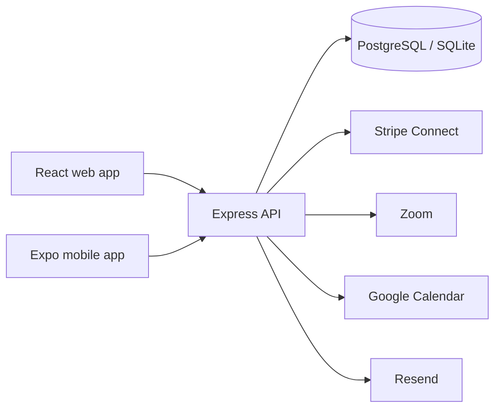

<div align="center">
  

  <h3>Community-powered tutoring that keeps academic support within reach.</h3>

  <p>
    NextDoorLearn connects underserved and low-income students with volunteer and
    affordable tutors, mentors, college students, and neighbors who can help them grow.
  </p>

  <p>
    <a href="https://next-door-learn.vercel.app"><strong>Visit the live web app</strong></a>
    ·
    <a href="./DEPLOYMENT.md">Deployment guide</a>
    ·
    <a href="./PRODUCTION_CHECKLIST.md">Production checklist</a>
  </p>
</div>

---

## Why NextDoorLearn

Talent is everywhere; access to academic help is not. Private tutoring can be
out of reach for the students who would benefit from it most, while capable
people in the same community often have knowledge and time they are willing to
share.

NextDoorLearn brings those groups together in one safer, structured place.
Students can discover support, request help, communicate, and schedule sessions.
Tutors can volunteer or offer affordable tutoring, manage availability, build a
credible profile, and support learners over time.

The project is currently in active beta development.

## What the platform supports

### For students

- Create a student profile and describe learning goals.
- Discover and compare tutors by subject, availability, rating, and cost.
- Save tutors, send connection requests, and message accepted connections.
- Schedule one-time or recurring sessions and join managed meeting rooms.
- Track upcoming sessions, learning progress, notifications, and reviews.
- Pay for eligible sessions through Stripe-powered checkout flows.

### For tutors

- Apply for tutor access and complete an approved public profile.
- Offer volunteer or low-cost support across selected subjects.
- Manage incoming requests, conversations, availability, and sessions.
- Connect payout details through Stripe-hosted onboarding.
- Track completed sessions, student support, ratings, and earnings.

### For trust and operations

- Role-based authentication and authorization for students, tutors, and admins.
- Tutor application review and activation workflows.
- Blocking, reporting, moderation, and community-safety controls.
- Email verification, password recovery, notifications, and delivery webhooks.
- Field-level protection for sensitive application data.
- Rate limiting, CORS controls, secure headers, and production health checks.

## Product surfaces

| Surface | Technology | Purpose |
| --- | --- | --- |
| Web app | React 19, Vite, React Router | Public site and complete student, tutor, and admin experience |
| Mobile app | React Native, Expo Router | Native iOS and Android companion using the same production API |
| API | Node.js, Express | Authentication, profiles, discovery, messaging, sessions, payments, and moderation |
| Data | PostgreSQL / SQLite | PostgreSQL in production with a zero-configuration SQLite fallback for local development |
| Integrations | Stripe, Zoom, Google Calendar, Resend | Payments, meeting rooms, calendars, and transactional email |



## Repository structure

```text
NextDoorLearn/
├── backend/       Express API, database adapters, services, tests, and scripts
├── frontend/      React and Vite web application with Playwright coverage
├── mobile/        Expo and React Native application for iOS and Android
├── logos/         NextDoorLearn brand assets
├── .github/       CI, scheduled checks, and production smoke workflows
└── *.md           Deployment, operations, release, and product documentation
```

## Run locally

### Prerequisites

- Node.js 20.19 or newer
- npm

The backend automatically uses a local SQLite database when `DATABASE_URL` is
not set, so PostgreSQL is not required for local development.

### 1. Start the API

```bash
cd backend
cp .env.example .env
npm install
npm start
```

The API runs at `http://localhost:3001`. Its health endpoint is available at
`http://localhost:3001/api/health`.

### 2. Start the web app

In a second terminal:

```bash
cd frontend
cp .env.example .env
npm install
npm run dev
```

Open `http://localhost:5173`.

### 3. Start the mobile app

In another terminal:

```bash
cd mobile
cp .env.example .env
npm install
npm start
```

Scan the Expo QR code from a phone on the same network. When testing against a
local API on a physical device, set `EXPO_PUBLIC_API_URL` to the computer's LAN
address rather than `localhost`.

## Environment configuration

Copy the checked-in `.env.example` file in each application directory and fill
in only the services you intend to use.

| Area | Important variables |
| --- | --- |
| Core API | `JWT_SECRET`, `FIELD_ENCRYPTION_KEY`, `FRONTEND_URL`, `CORS_ORIGINS` |
| Database | `DATABASE_URL`, `DATABASE_SSL`, `DATABASE_POOL_MAX` |
| Web and mobile | `VITE_API_URL`, `EXPO_PUBLIC_API_URL` |
| Email | `RESEND_API_KEY`, `EMAIL_FROM`, `RESEND_WEBHOOK_SECRET` |
| Meetings and calendar | `ZOOM_*`, `GOOGLE_CLIENT_ID`, `GOOGLE_CLIENT_SECRET` |
| Payments | `STRIPE_SECRET_KEY`, `STRIPE_PUBLISHABLE_KEY`, `STRIPE_WEBHOOK_SECRET` |
| Operations | `ADMIN_EMAILS`, `JOB_SECRET`, rate-limit settings |

Never place server secrets in `VITE_*` or `EXPO_PUBLIC_*` variables. Those values
are included in client builds. Local `.env` files, databases, uploads, logs, and
build outputs are ignored by Git.

## Quality checks

```bash
# Backend
cd backend
npm test
npm run smoke

# Web
cd frontend
npm run lint
npm run test:config
npm run build
npm run test:e2e

# Mobile
cd mobile
npm run lint
npm run typecheck
npm run export:web
```

Use the production smoke test only against an environment you control:

```bash
cd backend
SMOKE_API_URL=https://your-api.example.com/api \
SMOKE_FRONTEND_ORIGIN=https://your-app.example.com \
npm run smoke:production
```

## Deployment

The current deployment model uses:

- **Vercel** for the React web app
- **Render** for the Express API
- **Neon PostgreSQL** for production data
- **Expo Application Services** for native preview and production builds

See [DEPLOYMENT.md](./DEPLOYMENT.md) for configuration details,
[PRODUCTION_CHECKLIST.md](./PRODUCTION_CHECKLIST.md) for the release gate, and
[PAYMENT_OPERATIONS.md](./PAYMENT_OPERATIONS.md) before enabling live payments.

## Security notes

- Credentials belong in local environment files or hosting-provider secret stores.
- The repository's `.env.example` files contain placeholders only.
- Payment status is finalized from signed Stripe webhooks, not client responses.
- Production origins are explicitly allow-listed.
- Local databases and uploaded files are intentionally excluded from version control.
- Youth safety, marketplace policy, refunds, taxes, and tutor classification still
  require appropriate operational and legal review before a broad public launch.

## Project status

NextDoorLearn is an actively developed beta. The core student and tutor journeys,
web experience, native companion app, payments foundation, moderation controls,
and deployment infrastructure are implemented. Remaining launch work is tracked
in [PRODUCTION_FEATURE_BACKLOG.md](./PRODUCTION_FEATURE_BACKLOG.md) and the
[production checklist](./PRODUCTION_CHECKLIST.md).

## Founder

NextDoorLearn is created by [Peter Njoroge](https://www.linkedin.com/in/peter-njoroge13),
a computer science student building from lived experience with unequal access to
academic support.
